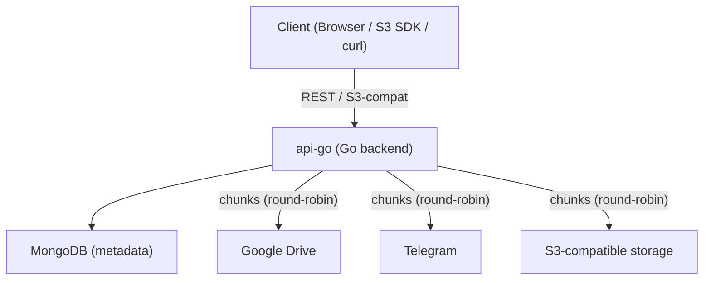

# SFree

[](LICENSE.txt)
[](https://go.dev/)

**Store files across Google Drive, Telegram, and S3-compatible services — access
them through one API or an S3-compatible interface.**

## Why SFree

Cloud storage is cheap in pieces — a free Google Drive here, a Telegram bot
there, a MinIO bucket on a spare VPS. But using them together is a manual mess.

SFree turns multiple storage services into a single object store. Upload a file
and SFree splits it into chunks, distributes them across your configured
sources, and reassembles them on download. You get one REST API, one
S3-compatible endpoint, and one browser UI for everything.

**Who it's for:** Self-hosters, homelab enthusiasts, and developers who want to
unify free-tier and personal storage backends behind a single interface.

**What it is not:** SFree is an experimental prototype. It does not replicate
chunks, provide erasure coding, or guarantee durability if an upstream source is
lost. See [Launch Caveats](#launch-caveats) for the full picture.

## Supported Storage Backends

| Backend | API support | Browser UI support | Notes |
| --- | --- | --- | --- |
| Google Drive | Yes | Yes | Richest quota and file metadata reporting |
| Telegram | Yes | No (API-only) | Uses bot API for chunk storage |
| S3-compatible | Yes | No (API-only) | Works with MinIO, Backblaze B2, Wasabi, etc. |

## Architecture



1. You register one or more **storage sources** (Google Drive, Telegram, or
   S3-compatible).
2. You create a **bucket** and select which sources back it.
3. Uploads are split into chunks and distributed across the selected sources in
   round-robin order.
4. Downloads reassemble the file from its chunk manifest.

Each bucket also gets generated S3 credentials, so any S3-compatible client can
read and write objects directly.

## Quick Start

### Prerequisites

- Go 1.24+
- Docker (for MongoDB)
- Node.js with npm (for the browser UI)

### 1. Start MongoDB

```bash
cd api-go
docker compose up -d
```

### 2. Run the Go API

```bash
cd api-go
ENV=local go run ./cmd/server
```

The API listens on `http://localhost:8080`. Swagger docs are at
`http://localhost:8080/swagger/index.html`.

### 3. Run the browser UI (optional)

```bash
cd webui
npm install
npm run dev
```

> **Note:** The checked-in frontend points at a hosted dev API URL in
> `webui/src/shared/api/*.ts`. Update those modules to `http://localhost:8080`
> for a fully local workflow.

## Repository Layout

| Directory | Purpose |
| --- | --- |
| `api-go/` | Primary Go backend — HTTP API, S3-compatible routes, Swagger docs, MongoDB metadata |
| `webui/` | React 19 + Vite frontend — signup, bucket management, file operations |
| `api/` | Deprecated Python backend (historical reference only) |
| `.woodpecker/` | Self-hosted Woodpecker CI/CD pipelines |
| `docs/` | Architecture notes, CI docs |

## Launch Caveats

SFree is an early-stage project. These constraints are current and intentional:

- **No redundancy.** Chunks are distributed, not replicated. Losing an upstream
  source can make files unrecoverable.
- **Basic auth only.** The API uses HTTP Basic Auth. The browser UI stores
  credentials in `localStorage`. Source API responses echo stored credential
  payloads.
- **Uneven observability.** Google Drive sources expose the richest file and
  quota info. Telegram and S3-compatible sources return less metadata.
- **Browser UI covers Google Drive only.** Telegram and S3-compatible source
  creation requires the API directly.

## Contributing

See [CONTRIBUTING.md](CONTRIBUTING.md) for setup, validation, and PR guidelines.
Architecture details are in [docs/architecture.md](docs/architecture.md) and CI
expectations in [docs/ci.md](docs/ci.md).

## License

MIT — see [LICENSE.txt](LICENSE.txt).
