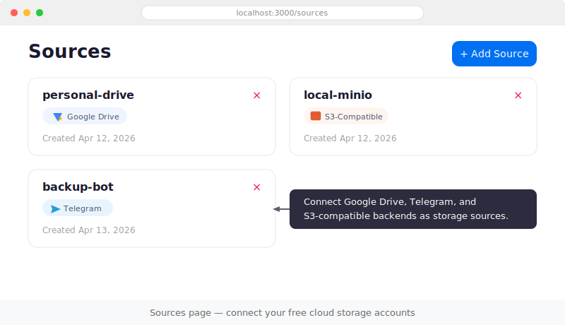
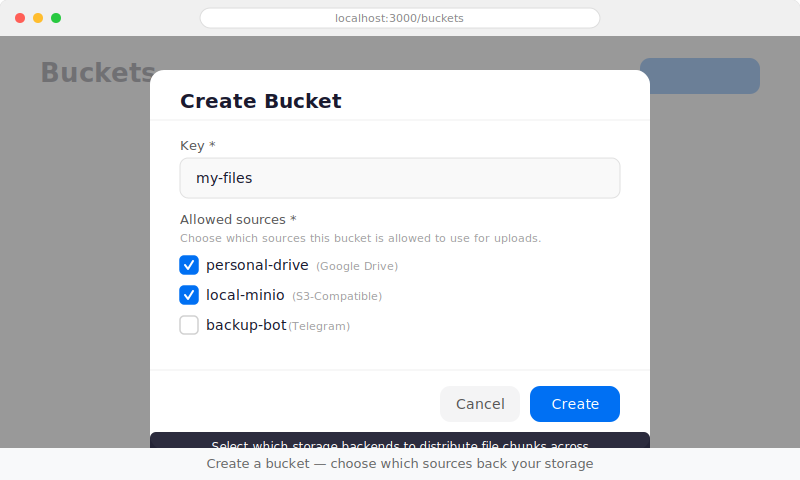
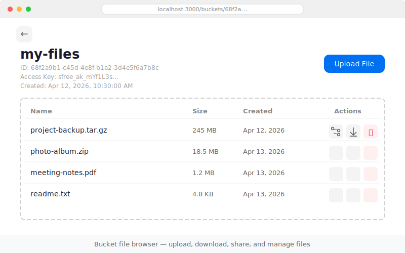
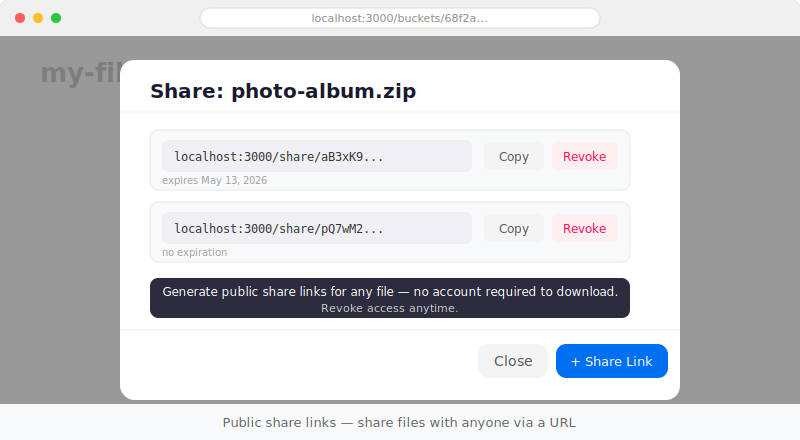
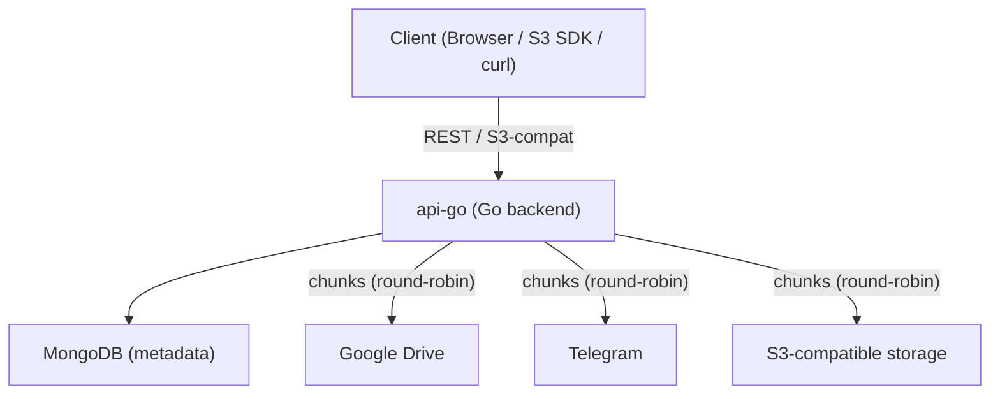

# SFree

[](LICENSE.txt)
[](https://go.dev/)

**One object store across Google Drive, Telegram, and any S3-compatible
service — with a REST API, S3-compatible endpoint, and browser UI.**

### Screenshots

<p align="center">
  
</p>
<p align="center">
  
</p>
<p align="center">
  
</p>
<p align="center">
  
</p>

## Why SFree

Cloud storage is cheap in pieces — a free Google Drive here, a Telegram bot
there, a MinIO bucket on a spare VPS. But stitching them together by hand is
tedious and error-prone.

SFree unifies multiple storage backends behind a single interface. Upload a
file and SFree splits it into chunks, distributes them across your configured
sources in round-robin order, and reassembles them on download. You interact
through one REST API, one S3-compatible endpoint, or one browser UI — your
choice.

**Who it's for:** Self-hosters, homelab enthusiasts, and developers who want to
pool free-tier and personal storage services into one namespace.

**What it is not:** SFree is an early-stage prototype. It does not replicate
chunks, provide erasure coding, or guarantee durability if an upstream source
disappears. See [Launch Caveats](#launch-caveats) for the full picture.

## Features

- **Multi-backend buckets** backed by Google Drive, Telegram, and
  S3-compatible storage sources.
- **Browser UI, REST API, CLI, and S3-compatible endpoint** for managing
  sources, buckets, objects, and generated S3 credentials.
- **RBAC and bucket sharing** for scoped access to stored objects.
- **Multipart upload and presigned URLs** for S3-compatible client workflows.
- **Source failover** during object reads when a configured source is
  temporarily unavailable.
- **Rate limiting** on API traffic.
- **Credential encryption** for stored upstream source secrets.

## Supported Storage Backends

| Backend | API | Browser UI | Notes |
| --- | --- | --- | --- |
| Google Drive | Yes | Yes | Native quota and file metadata reporting |
| Telegram | Yes | Yes | Uses bot API for chunk storage; no native quota meter |
| S3-compatible | Yes | Yes | Works with MinIO, Backblaze B2, Wasabi, etc.; health is supported but provider-wide quota is not inferred |

## Architecture



1. You register one or more **storage sources** (Google Drive, Telegram, or
   S3-compatible).
2. You create a **bucket** and select which sources back it.
3. Uploads are split into chunks and distributed across the selected sources in
   round-robin order.
4. Downloads reassemble the file from its chunk manifest.

Each bucket also gets generated S3 credentials, so any S3-compatible client can
read and write objects directly.

## Quick Start

> **Full walkthrough:** [Docker Compose Quickstart](docs/quickstart.md) — zero
> to upload in under 5 minutes, with expected output for every step.

### Prerequisites

- Docker and Docker Compose

### 1. Start the full stack

```bash
git clone https://github.com/siberianbearofficial/sfree.git
cd sfree
docker compose up --build
```

This starts MongoDB, the Go API, a React frontend (with nginx), and a MinIO
instance for local S3-compatible source testing.

| Service  | URL                          |
| -------- | ---------------------------- |
| Frontend | http://localhost:3000        |
| API      | http://localhost:8080        |
| API Docs | http://localhost:8080/api/docs |
| OpenAPI JSON | http://localhost:8080/api/openapi.json |
| MinIO Console | http://localhost:9001   |

### 2. Try it out

1. Open http://localhost:3000 and sign up.
2. Create an S3-compatible source via the API (using the bundled MinIO):
   ```bash
   # Create user first, note the password from the response
   curl -X POST http://localhost:8080/api/v1/users \
     -H 'Content-Type: application/json' \
     -d '{"username": "demo"}'

   # Use the returned password for Basic Auth (base64 of demo:PASSWORD)
   # Create an S3-compatible source backed by MinIO
   curl -X POST http://localhost:8080/api/v1/sources/s3 \
     -H 'Content-Type: application/json' \
     -H 'Authorization: Basic BASE64_CREDENTIALS' \
     -d '{
       "name": "local-minio",
       "endpoint": "http://minio:9000",
       "bucket": "sfree-data",
       "access_key_id": "minioadmin",
       "secret_access_key": "minioadmin",
       "region": "us-east-1",
       "path_style": true
     }'
   ```
3. Create a bucket in the UI (select the MinIO source).
4. Upload a file through the UI.
5. Download the same file via an S3 client using the bucket's S3 credentials:
   ```bash
   mc alias set --api S3v4 --path on sfree http://localhost:8080 BUCKET_ACCESS_KEY BUCKET_ACCESS_SECRET

   mc cat sfree/BUCKET_KEY/OBJECT_KEY > ./local-copy
   ```

### Manual dev setup (without Docker Compose)

<details>
<summary>Click to expand</summary>

#### Prerequisites

- Go 1.25+
- Docker (for MongoDB)
- Node.js 20+ with npm (for the browser UI)

#### 1. Start MongoDB

```bash
cd api-go
docker compose up -d
```

#### 2. Run the Go API

```bash
cd api-go
ENV=local go run ./cmd/server
```

The API listens on `http://localhost:8080`.

#### 3. Run the browser UI

```bash
cd webui
npm ci
VITE_API_BASE=http://localhost:8080/api/v1 npm run dev
```

`npm ci` installs both production and dev dependencies (TypeScript, ESLint,
etc.) from the lockfile. Set `VITE_API_BASE` to point the frontend at your
local API. Without it, the frontend defaults to a relative `/api/v1` path
(designed for the Docker Compose setup where nginx proxies to the API).

</details>

### CLI

Build the CLI from source:

```bash
cd api-go
make build-cli
# binary at bin/sfree
```

Configure credentials via flags or environment variables:

```bash
export SFREE_SERVER=http://localhost:8080
export SFREE_USER=demo
export SFREE_PASSWORD=your-password
```

Usage examples:

```bash
# List storage sources
sfree sources list

# List buckets
sfree buckets list

# Create a bucket (generates S3 access keys)
sfree buckets create --key my-bucket --sources SOURCE_ID_1,SOURCE_ID_2

# Upload a file
sfree upload BUCKET_ID path/to/file.txt

# List files in a bucket
sfree files list BUCKET_ID

# Download a file
sfree download BUCKET_ID FILE_ID output.txt

# Generate S3-compatible credentials
sfree keys create --bucket my-s3-bucket --sources SOURCE_ID
```

Run `sfree --help` or `sfree <command> --help` for full usage details.

## Repository Layout

| Directory | Purpose |
| --- | --- |
| `api-go/` | **Primary backend** — Go HTTP API, S3-compatible routes, Swagger docs, MongoDB metadata |
| `webui/` | React 19 + Vite frontend — signup, source management, bucket operations, file upload/download |
| `api-python-archived/` | Archived Python backend (historical reference only — not maintained) |
| `docs/` | Architecture notes, quickstart walkthrough, CI docs |
| `.woodpecker/` | Self-hosted Woodpecker CI/CD pipelines |

## Launch Caveats

SFree is an early-stage project. These constraints are current and intentional:

- **No redundancy.** Chunks are distributed, not replicated. Losing an upstream
  source can make files unrecoverable.
- **Authentication is still early.** The API supports HTTP Basic Auth and OAuth,
  but auth flows and browser token storage are not production-hardened.
- **Uneven observability.** Google Drive sources expose the richest file and
  quota info. Telegram and S3-compatible sources can still show health and
  stored bytes, but SFree does not fake provider-wide capacity for them.

## Contributing

See [CONTRIBUTING.md](CONTRIBUTING.md) for local setup, validation, and PR
guidelines. Further reading:

- [docs/architecture.md](docs/architecture.md) — system design, data model, and
  storage behavior
- [docs/quickstart.md](docs/quickstart.md) — Docker Compose walkthrough with
  expected output for every step
- [docs/ci.md](docs/ci.md) — Woodpecker pipeline triggers, secrets, and
  published images

## License

MIT — see [LICENSE.txt](LICENSE.txt).
